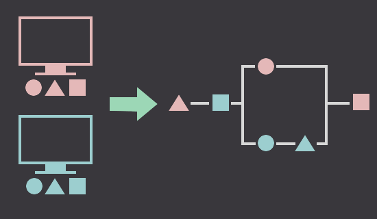
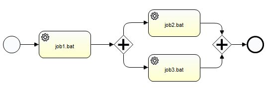

# GoCuto

GoCuto is a process control tool that can execute cross-server processes in the order you like.

## Installation

Download binary packages on [GoCuto Official Website](http://cuto.unirita.co.jp/cuto/).

Or, build GoCoto with go command. (need Go 1.4 or higher)

    go get github.com/unirita/cuto/master
    go get github.com/unirita/cuto/servant
    go get github.com/unirita/cuto/show

## Commands

### Master

Master command executes group of processes (called Jobnet).
Use this command when you want to run Jobnet.

    master -n JobnetName -s -c /path/to/master.ini

**Options**

|Option       |Description                                                                                    |
|-------------|-----------------------------------------------------------------------------------------------|
|-v           |Show version information                                                                       |
|-n JobnetName|Set name of Jobnet                                                                             |
|-s           |Use this option if you want to run Jobnet. If didn't, master command only checks Jobnet syntax.|
|-c FilePath  |Set file path of master.ini                                                                    |

### Servant

Servant command is a resident process which executes processes by request from the Master.
You must run this command every server to use Master command.

    servant -c /path/to/servant.ini

**Options**

|Option       |Description                 |
|-------------|----------------------------|
|-v           |Show version information    |
|-c FilePath  |Set file path of servant.ini|

### Show

Show command is a viewer for Jobnet execution result.

    show -c /path/to/master.ini [options]

**Options**

|Option              |Description                                                                  |
|--------------------|-----------------------------------------------------------------------------|
|-v                  |Show version information                                                     |
|-help               |Show usage                                                                   |
|-c FilePath         |Set file path of master.ini                                                  |
|-jobnet JobnetName  |Narrow result by Jobnet                                                      |
|-nid InstanceID     |Narrow result by Instance ID (unique ID for every execution)                 |
|-from Date, -to Date|Narrow result by range of executed date                                      |
|-status Status      |Narrow result by status (select from "normal", "abnormal", "warn", "running")|
|-format Format      |Select output format from "json" or "csv"                                    |
|-utc                |Set or show date value as UTC timezone, not as local timezone                |

## Configuration

GoCuto uses some configuration files written by [toml format](https://github.com/toml-lang/toml).

### master.ini

master.ini is configuration file for Master command.

**Tables and Keys**

|Table|Key                   |Type   |Description                                                                          |
|-----|----------------------|-------|-------------------------------------------------------------------------------------|
|job  |default_node          |String |Host name of default node which Job (process) is executed on.                        |
|job  |default_port          |Integer|Port number of default node which Job is executed on.                                |
|job  |default_timeout_min   |Integer|Default time limit to wait end of Job execution. (minute)                            |
|job  |connection_timeout_sec|Integer|Time limit to wait connection keep alive signal. (second)                            |
|job  |time_tracking_span_min|Integer|Time span to display elapsed time from execution started time. (minute)              |
|job  |attempt_limit         |Integer|Max retry number of times when Job is not able to start.                             |
|dir  |jobnet_dir            |String |Directory to put Jobnet definition files in.                                         |
|dir  |log_dir               |String |Directory to output Master command log files.                                        |
|dir  |db_dir                |String |Directory to put execution result db file in.                                        |
|log  |output_level          |String |Minimum log level. Select from "trace", "debug", "info", "warn", "error", "critical".|
|log  |max_size_kb           |Integer|Max size of log file. (KByte)                                                        |
|log  |max_generation        |Integer|Max generation for log file rotation.                                                |
|log  |timeout_sec           |Integer|Time limit to wait log output ends.                                                  |

### servant.ini

master.ini is configuration file for Servant command.

**Tables and Keys**

|Table|Key               |Type   |Description                                                                          |
|-----|------------------|-------|-------------------------------------------------------------------------------------|
|sys  |bind_address      |String |Listen host name of servant.                                                         |
|sys  |bind_port         |Integer|Listen port number of servant.                                                       |
|job  |multi_proc        |Integer|Max number of Job execution at same time.                                            |
|job  |heartbeat_span_sec|Integer|Time span to send keep alive signal for master. (second)                             |
|dir  |job_dir           |String |Directory to put files be executed as Job in.                                        |
|dir  |joblog_dir        |String |Directory to output Job log files.                                                   |
|dir  |log_dir           |String |Directory to output Servant command log files.                                       |
|log  |output_level      |String |Minimum log level. Select from "trace", "debug", "info", "warn", "error", "critical".|
|log  |max_size_kb       |Integer|Max size of log file. (KByte)                                                        |
|log  |max_generation    |Integer|Max generation for log file rotation.                                                |
|log  |timeout_sec       |Integer|Time limit to wait log output ends.                                                  |

## Jobnet definition

### Flow definition.

Create Jobnet Flow file as [BPMN 2.0](http://www.omg.org/spec/BPMN/2.0/) XML format.

**Available tags**

|Tag name       |Description                           |
|---------------|--------------------------------------|
|ServiceTask    |Corresponds with a Job.               |
|ParallelGateway|Signifies start or end of branch flow.|
|StartEvent     |Signifies entry point.                |
|EndEvent       |Signifies exit point.                 |
|SequenceFlow   |Connects two nodes.                   |

**Example**

If you want to design this flow,

Create flow file, like this.

    <?xml version="1.0" encoding="UTF-8"?>
    <Definitions>
        <Process>
            <StartEvent id="start"/>
            <EndEvent id="end"/>
            <ServiceTask id="job1" name="job1.bat"/>
            <ServiceTask id="job2" name="job2.bat"/>
            <ServiceTask id="job3" name="job3.bat"/>
            <ParallelGateway id="gateway1"/>
            <ParallelGateway id="gateway2"/>
            <SequenceFlow sourceRef="start" targetRef="job1"/>
            <SequenceFlow sourceRef="job1" targetRef="gateway1"/>
            <SequenceFlow sourceRef="gateway1" targetRef="job2"/>
            <SequenceFlow sourceRef="gateway1" targetRef="job3"/>
            <SequenceFlow sourceRef="job2" targetRef="gateway2"/>
            <SequenceFlow sourceRef="job3" targetRef="gateway2"/>
            <SequenceFlow sourceRef="gateway2" targetRef="end"/>
        </Process>
    </Definitions>

### Job detail definition

Create Job detail file as CSV format.

**CSV Columns**

|   #|Column name      |Description                                                                         |
|---:|-----------------|------------------------------------------------------------------------------------|
|   1|Job name         |Name of Job to link with ServiceTask tag in Flow file.                              |
|   2|Node name        |Host name of server where to execute Job.                                           |
|   3|Port number      |Port number of server where to execute Job.                                         |
|   4|File path        |File which is executed as Job.                                                      |
|   5|Arguments        |Command line arguments for Job.                                                     |
|   6|Environments     |Environment variables for Job.                                                      |
|   7|Working directory|Working directory at execution time.                                                |
|   8|RC to warn       |Job is judged as warning when its RC is over this value.                            |
|   9|Output to warn   |Job is judged as warning when its stdout or stderr includes this value.             |
|  10|RC to error      |ob is judged as error when its RC is over this value.                               |
|  11|Output to error  |Job is judged as error when its stdout or stderr includes this value.               |
|  12|Timeout          |Time limit to wait end of Job execution. (minute)                                   |
|  13|Secondary node   |Host name of secondary server will be used when Job can not start at first server.  |
|  14|Secondary port   |Port number of secondary server will be used when Job can not start at first server.|

## License

Licensed under an [GPLv2](LICENSE) license.

Copyright. (C) 2015 UNIRITA Inc,
